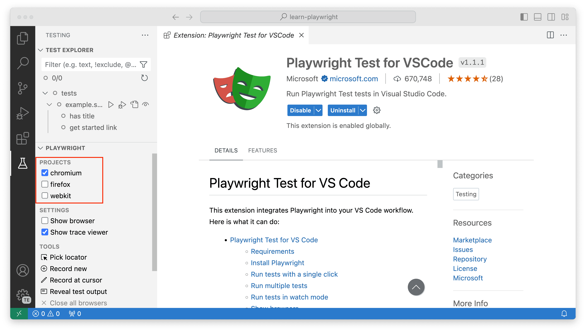

## Introduction

Each version of copilotbrowser needs specific versions of browser binaries to operate. You will need to use the copilotbrowser CLI to install these browsers.

With every release, copilotbrowser updates the versions of the browsers it supports, so that the latest copilotbrowser would support the latest browsers at any moment. It means that every time you update copilotbrowser, you might need to re-run the `install` CLI command.

## Install browsers

copilotbrowser can install supported browsers. Running the command without arguments will install the default browsers.

```bash js
npx copilotbrowser install
```

```bash java
mvn exec:java -e -D exec.mainClass=com.microsoft.copilotbrowser.CLI -D exec.args="install"
```

```bash python
copilotbrowser install
```

```bash csharp
pwsh bin/Debug/netX/copilotbrowser.ps1 install
```

You can also install specific browsers by providing an argument:

```bash js
npx copilotbrowser install webkit
```

```bash java
mvn exec:java -e -D exec.mainClass=com.microsoft.copilotbrowser.CLI -D exec.args="install webkit"
```

```bash python
copilotbrowser install webkit
```

```bash csharp
pwsh bin/Debug/netX/copilotbrowser.ps1 install webkit
```

See all supported browsers:

```bash js
npx copilotbrowser install --help
```

```bash java
mvn exec:java -e -D exec.mainClass=com.microsoft.copilotbrowser.CLI -D exec.args="install --help"
```

```bash python
copilotbrowser install --help
```

```bash csharp
pwsh bin/Debug/netX/copilotbrowser.ps1 install --help
```

### Install browsers via API

It's possible to run Command line tools commands via the .NET API:

```csharp
var exitCode = Microsoft.copilotbrowser.Program.Main(new[] {"install"});
if (exitCode != 0)
{
    throw new Exception($"copilotbrowser exited with code {exitCode}");
}
```

## Install system dependencies

System dependencies can get installed automatically. This is useful for CI environments.

```bash js
npx copilotbrowser install-deps
```

```bash java
mvn exec:java -e -D exec.mainClass=com.microsoft.copilotbrowser.CLI -D exec.args="install-deps"
```

```bash python
copilotbrowser install-deps
```

```bash csharp
pwsh bin/Debug/netX/copilotbrowser.ps1 install-deps
```

You can also install the dependencies for a single browser by passing it as an argument:

```bash js
npx copilotbrowser install-deps chromium
```

```bash java
mvn exec:java -e -D exec.mainClass=com.microsoft.copilotbrowser.CLI -D exec.args="install-deps chromium"
```

```bash python
copilotbrowser install-deps chromium
```

```bash csharp
pwsh bin/Debug/netX/copilotbrowser.ps1 install-deps chromium
```

It's also possible to combine `install-deps` with `install` so that the browsers and OS dependencies are installed with a single command.

```bash js
npx copilotbrowser install --with-deps chromium
```

```bash java
mvn exec:java -e -D exec.mainClass=com.microsoft.copilotbrowser.CLI -D exec.args="install --with-deps chromium"
```

```bash python
copilotbrowser install --with-deps chromium
```

```bash csharp
pwsh bin/Debug/netX/copilotbrowser.ps1 install --with-deps chromium
```

See [system requirements](./intro.md#system-requirements) for officially supported operating systems.

## Update copilotbrowser regularly

By keeping your copilotbrowser version up to date you will be able to use new features and test your app on the latest browser versions and catch failures before the latest browser version is released to the public.

```bash
# Update copilotbrowser
npm install -D @copilotbrowser/test@latest

# Install new browsers
npx copilotbrowser install
```
Check the [release notes](./release-notes.md) to see what the latest version is and what changes have been released.

```bash
# See what version of copilotbrowser you have by running the following command
npx copilotbrowser --version
```

## Configure Browsers

copilotbrowser can run tests on Chromium, WebKit and Firefox browsers as well as branded browsers such as Google Chrome and Microsoft Edge. It can also run on emulated tablet and mobile devices. See the [registry of device parameters](https://github.com/dayour/copilotbrowser/blob/main/packages/copilotbrowser-core/src/server/deviceDescriptorsSource.json) for a complete list of selected desktop, tablet and mobile devices.

### Run tests on different browsers

copilotbrowser can run your tests in multiple browsers and configurations by setting up **projects** in the config. You can also add [different options](./test-configuration) for each project.

```js
import { defineConfig, devices } from '@copilotbrowser/test';

export default defineConfig({
  projects: [
    /* Test against desktop browsers */
    {
      name: 'chromium',
      use: { ...devices['Desktop Chrome'] },
    },
    {
      name: 'firefox',
      use: { ...devices['Desktop Firefox'] },
    },
    {
      name: 'webkit',
      use: { ...devices['Desktop Safari'] },
    },
    /* Test against mobile viewports. */
    {
      name: 'Mobile Chrome',
      use: { ...devices['Pixel 5'] },
    },
    {
      name: 'Mobile Safari',
      use: { ...devices['iPhone 12'] },
    },
    /* Test against branded browsers. */
    {
      name: 'Google Chrome',
      use: { ...devices['Desktop Chrome'], channel: 'chrome' }, // or 'chrome-beta'
    },
    {
      name: 'Microsoft Edge',
      use: { ...devices['Desktop Edge'], channel: 'msedge' }, // or 'msedge-dev'
    },
  ],
});
```

copilotbrowser will run all projects by default.

```bash
npx copilotbrowser test

Running 7 tests using 5 workers

  ✓ [chromium] › example.spec.ts:3:1 › basic test (2s)
  ✓ [firefox] › example.spec.ts:3:1 › basic test (2s)
  ✓ [webkit] › example.spec.ts:3:1 › basic test (2s)
  ✓ [Mobile Chrome] › example.spec.ts:3:1 › basic test (2s)
  ✓ [Mobile Safari] › example.spec.ts:3:1 › basic test (2s)
  ✓ [Google Chrome] › example.spec.ts:3:1 › basic test (2s)
  ✓ [Microsoft Edge] › example.spec.ts:3:1 › basic test (2s)
```

Use the `--project` command line option to run a single project.

```bash
npx copilotbrowser test --project=firefox

Running 1 test using 1 worker

  ✓ [firefox] › example.spec.ts:3:1 › basic test (2s)
```

With the VS Code extension you can run your tests on different browsers by checking the checkbox next to the browser name in the copilotbrowser sidebar. These names are defined in your copilotbrowser config file under the projects section. The default config when installing copilotbrowser gives you 3 projects, Chromium, Firefox and WebKit. The first project is selected by default.



To run tests on multiple projects(browsers), select each project by checking the checkboxes next to the project name.


### Run tests on different browsers

Run tests on a specific browser:

```bash
pytest test_login.py --browser webkit
```

Run tests on multiple browsers:

```bash
pytest test_login.py --browser webkit --browser firefox
```

Test against mobile viewports:

```bash
pytest test_login.py --device="iPhone 13"
```
Test against branded browsers:

```bash
pytest test_login.py --browser-channel msedge
```

### Run tests on different browsers

Run tests on a specific browser:

```java
import com.microsoft.copilotbrowser.*;

public class Example {
  public static void main(String[] args) {
    try (copilotbrowser copilotbrowser = copilotbrowser.create()) {
      // Launch chromium, firefox or webkit.
      Browser browser = copilotbrowser.chromium().launch();
      Page page = browser.newPage();
      // ...
    }
  }
}
```

Run tests on multiple browsers and make it based on the environment variable `BROWSER`:

```java
import com.microsoft.copilotbrowser.*;

public class Example {
  public static void main(String[] args) {
    try (copilotbrowser copilotbrowser = copilotbrowser.create()) {
      Browser browser = null;
      String browserName = System.getenv("BROWSER");
      if (browserName.equals("chromium")) {
        browser = copilotbrowser.chromium().launch();
      } else if (browserName.equals("firefox")) {
        browser = copilotbrowser.firefox().launch();
      } else if (browserName.equals("webkit")) {
        browser = copilotbrowser.webkit().launch();
      }
      Page page = browser.newPage();
      // ...
    }
  }
}
```

### Run tests on different browsers

Run tests on a specific browser:

```bash
dotnet test -- copilotbrowser.BrowserName=webkit
```

To run your test on multiple browsers or configurations you need to invoke the `dotnet test` command multiple times. You can either specify the `BROWSER` environment variable or set the `copilotbrowser.BrowserName` via the runsettings file:

```bash
dotnet test --settings:chromium.runsettings
dotnet test --settings:firefox.runsettings
dotnet test --settings:webkit.runsettings
```

```xml
<?xml version="1.0" encoding="utf-8"?>
  <RunSettings>
    <copilotbrowser>
      <BrowserName>chromium</BrowserName>
    </copilotbrowser>
  </RunSettings>
```

### Chromium

For Google Chrome, Microsoft Edge and other Chromium-based browsers, by default, copilotbrowser uses open source Chromium builds. Since the Chromium project is ahead of the branded browsers, when the world is on Google Chrome N, copilotbrowser already supports Chromium N+1 that will be released in Google Chrome and Microsoft Edge a few weeks later.

### Chromium: headless shell

copilotbrowser ships a regular Chromium build for headed operations and a separate [chromium headless shell](https://developer.chrome.com/blog/chrome-headless-shell) for headless mode.

If you are only running tests in headless shell (i.e. the `channel` option is **not** specified), for example on CI, you can avoid downloading the full Chromium browser by passing `--only-shell` during installation.

```bash js
# only running tests headlessly
npx copilotbrowser install --with-deps --only-shell
```

```bash java
# only running tests headlessly
mvn exec:java -e -D exec.mainClass=com.microsoft.copilotbrowser.CLI -D exec.args="install --with-deps --only-shell"
```

```bash python
# only running tests headlessly
copilotbrowser install --with-deps --only-shell
```

```bash csharp
# only running tests headlessly
pwsh bin/Debug/netX/copilotbrowser.ps1 install --with-deps --only-shell
```

### Chromium: new headless mode

You can opt into the new headless mode by using `'chromium'` channel. As [official Chrome documentation puts it](https://developer.chrome.com/blog/chrome-headless-shell):

> New Headless on the other hand is the real Chrome browser, and is thus more authentic, reliable, and offers more features. This makes it more suitable for high-accuracy end-to-end web app testing or browser extension testing.

See [issue #33566](https://github.com/dayour/copilotbrowser/issues/33566) for details.

```js
import { defineConfig, devices } from '@copilotbrowser/test';

export default defineConfig({
  projects: [
    {
      name: 'chromium',
      use: { ...devices['Desktop Chrome'], channel: 'chromium' },
    },
  ],
});
```

```java
import com.microsoft.copilotbrowser.*;

public class Example {
  public static void main(String[] args) {
    try (copilotbrowser copilotbrowser = copilotbrowser.create()) {
      Browser browser = copilotbrowser.chromium().launch(new BrowserType.LaunchOptions().setChannel("chromium"));
      Page page = browser.newPage();
      // ...
    }
  }
}
```

```bash python
pytest test_login.py --browser-channel chromium
```

```xml csharp
<?xml version="1.0" encoding="utf-8"?>
<RunSettings>
  <copilotbrowser>
    <BrowserName>chromium</BrowserName>
    <LaunchOptions>
      <Channel>chromium</Channel>
    </LaunchOptions>
  </copilotbrowser>
</RunSettings>
```

```bash csharp
dotnet test -- copilotbrowser.BrowserName=chromium copilotbrowser.LaunchOptions.Channel=chromium
```

With the new headless mode, you can skip downloading the headless shell during browser installation by using the `--no-shell` option:

```bash js
# only running tests headlessly
npx copilotbrowser install --with-deps --no-shell
```

```bash java
# only running tests headlessly
mvn exec:java -e -D exec.mainClass=com.microsoft.copilotbrowser.CLI -D exec.args="install --with-deps --no-shell"
```

```bash python
# only running tests headlessly
copilotbrowser install --with-deps --no-shell
```

```bash csharp
# only running tests headlessly
pwsh bin/Debug/netX/copilotbrowser.ps1 install --with-deps --no-shell
```

### Google Chrome & Microsoft Edge

While copilotbrowser can download and use the recent Chromium build, it can operate against the branded Google Chrome and Microsoft Edge browsers available on the machine (note that copilotbrowser doesn't install them by default). In particular, the current copilotbrowser version will support Stable and Beta channels of these browsers.

Available channels are `chrome`, `msedge`, `chrome-beta`, `msedge-beta`, `chrome-dev`, `msedge-dev`, `chrome-canary`, `msedge-canary`.

:::warning
Certain Enterprise Browser Policies may impact copilotbrowser's ability to launch and control Google Chrome and Microsoft Edge. Running in an environment with browser policies is outside of the copilotbrowser project's scope.
:::

:::warning
Google Chrome and Microsoft Edge have switched to a [new headless mode](https://developer.chrome.com/docs/chromium/headless) implementation that is closer to a regular headed mode. This differs from [chromium headless shell](https://developer.chrome.com/blog/chrome-headless-shell) that is used in copilotbrowser by default when running headless, so expect different behavior in some cases. See [issue #33566](https://github.com/dayour/copilotbrowser/issues/33566) for details.
:::

```js
import { defineConfig, devices } from '@copilotbrowser/test';

export default defineConfig({
  projects: [
    /* Test against branded browsers. */
    {
      name: 'Google Chrome',
      use: { ...devices['Desktop Chrome'], channel: 'chrome' }, // or 'chrome-beta'
    },
    {
      name: 'Microsoft Edge',
      use: { ...devices['Desktop Edge'], channel: 'msedge' }, // or "msedge-beta" or 'msedge-dev'
    },
  ],
});
```

```java
import com.microsoft.copilotbrowser.*;

public class Example {
  public static void main(String[] args) {
    try (copilotbrowser copilotbrowser = copilotbrowser.create()) {
      // Channel can be "chrome", "msedge", "chrome-beta", "msedge-beta" or "msedge-dev".
      Browser browser = copilotbrowser.chromium().launch(new BrowserType.LaunchOptions().setChannel("msedge"));
      Page page = browser.newPage();
      // ...
    }
  }
}
```

```bash python
pytest test_login.py --browser-channel msedge
```

```xml csharp
<?xml version="1.0" encoding="utf-8"?>
<RunSettings>
  <copilotbrowser>
    <BrowserName>chromium</BrowserName>
    <LaunchOptions>
      <Channel>msedge</Channel>
    </LaunchOptions>
  </copilotbrowser>
</RunSettings>
```

```bash csharp
dotnet test -- copilotbrowser.BrowserName=chromium copilotbrowser.LaunchOptions.Channel=msedge
```

######

Alternatively when using the library directly, you can specify the browser **BrowserType.launch.channel** when launching the browser:

```python
from copilotbrowser.sync_api import sync_copilotbrowser

with sync_copilotbrowser() as p:
    # Channel can be "chrome", "msedge", "chrome-beta", "msedge-beta" or "msedge-dev".
    browser = p.chromium.launch(channel="msedge")
    page = browser.new_page()
    page.goto("https://copilotbrowser.dev")
    print(page.title())
    browser.close()
```

#### Installing Google Chrome & Microsoft Edge

If Google Chrome or Microsoft Edge is not available on your machine, you can install
them using the copilotbrowser command line tool:

```bash lang=js
npx copilotbrowser install msedge
```

```bash lang=python
copilotbrowser install msedge
```

```bash lang=csharp
pwsh bin/Debug/netX/copilotbrowser.ps1 install msedge
```

```batch lang=java
mvn exec:java -e -D exec.mainClass=com.microsoft.copilotbrowser.CLI -D exec.args="install msedge"
```

:::warning
Google Chrome or Microsoft Edge installations will be installed at the
default global location of your operating system overriding your current browser installation.
:::

Run with the `--help` option to see a full a list of browsers that can be installed.

#### When to use Google Chrome & Microsoft Edge and when not to?

##### Defaults

Using the default copilotbrowser configuration with the latest Chromium is a good idea most of the time.
Since copilotbrowser is ahead of Stable channels for the browsers, it gives peace of mind that the
upcoming Google Chrome or Microsoft Edge releases won't break your site. You catch breakage
early and have a lot of time to fix it before the official Chrome update.

##### Regression testing

Having said that, testing policies often require regression testing to be performed against
the current publicly available browsers. In this case, you can opt into one of the stable channels,
`"chrome"` or `"msedge"`.

##### Media codecs

Another reason for testing using official binaries is to test functionality related to media codecs.
Chromium does not have all the codecs that Google Chrome or Microsoft Edge are bundling due to
various licensing considerations and agreements. If your site relies on this kind of codecs (which is
rarely the case), you will also want to use the official channel.

##### Enterprise policy

Google Chrome and Microsoft Edge respect enterprise policies, which include limitations to the capabilities, network proxy, mandatory extensions that stand in the way of testing. So if you are part of the organization that uses such policies, it is easiest to use bundled Chromium for your local testing, you can still opt into stable channels on the bots that are typically free of such restrictions.

### Firefox

copilotbrowser's Firefox version matches the recent [Firefox Stable](https://www.mozilla.org/en-US/firefox/new/) build. copilotbrowser doesn't work with the branded version of Firefox since it relies on patches.

Note that availability of certain features, which depend heavily on the underlying platform, may vary between operating systems. For example, available media codecs vary substantially between Linux, macOS and Windows.

### WebKit

copilotbrowser's WebKit is derived from the latest WebKit main branch sources, often before these updates are incorporated into Apple Safari and other WebKit-based browsers. This gives a lot of lead time to react on the potential browser update issues. copilotbrowser doesn't work with the branded version of Safari since it relies on patches. Instead, you can test using the most recent WebKit build.

Note that availability of certain features, which depend heavily on the underlying platform, may vary between operating systems. For example, available media codecs vary substantially between Linux, macOS and Windows. While running WebKit on Linux CI is usually the most affordable option, for the closest-to-Safari experience you should run WebKit on mac, for example if you do video playback.

## Install behind a firewall or a proxy

By default, copilotbrowser downloads browsers from Microsoft's CDN.

Sometimes companies maintain an internal proxy that blocks direct access to the public
resources. In this case, copilotbrowser can be configured to download browsers via a proxy server.

```bash tab=bash-bash lang=js
HTTPS_PROXY=https://192.0.2.1 npx copilotbrowser install
```

```batch tab=bash-batch lang=js
set HTTPS_PROXY=https://192.0.2.1
npx copilotbrowser install
```

```powershell tab=bash-powershell lang=js
$Env:HTTPS_PROXY="https://192.0.2.1"
npx copilotbrowser install
```

```bash tab=bash-bash lang=python
pip install copilotbrowser
HTTPS_PROXY=https://192.0.2.1 copilotbrowser install
```

```batch tab=bash-batch lang=python
set HTTPS_PROXY=https://192.0.2.1
pip install copilotbrowser
copilotbrowser install
```

```powershell tab=bash-powershell lang=python
$Env:HTTPS_PROXY="https://192.0.2.1"
pip install copilotbrowser
copilotbrowser install
```

```bash tab=bash-bash lang=java
HTTPS_PROXY=https://192.0.2.1 mvn exec:java -e -D exec.mainClass=com.microsoft.copilotbrowser.CLI -D exec.args="install"
```

```batch tab=bash-batch lang=java
set HTTPS_PROXY=https://192.0.2.1
mvn exec:java -e -D exec.mainClass=com.microsoft.copilotbrowser.CLI -D exec.args="install"
```

```powershell tab=bash-powershell lang=java
$Env:HTTPS_PROXY="https://192.0.2.1"
mvn exec:java -e -D exec.mainClass=com.microsoft.copilotbrowser.CLI -D exec.args="install"
```

```bash tab=bash-bash lang=csharp
HTTPS_PROXY=https://192.0.2.1 pwsh bin/Debug/netX/copilotbrowser.ps1 install
```

```batch tab=bash-batch lang=csharp
set HTTPS_PROXY=https://192.0.2.1
pwsh bin/Debug/netX/copilotbrowser.ps1 install
```

```powershell tab=bash-powershell lang=csharp
$Env:HTTPS_PROXY="https://192.0.2.1"
pwsh bin/Debug/netX/copilotbrowser.ps1 install
```

If the requests of the proxy get intercepted with a custom untrusted certificate authority (CA) and it yields to `Error: self signed certificate in certificate chain` while downloading the browsers, you must set your custom root certificates via the [`NODE_EXTRA_CA_CERTS`](https://nodejs.org/api/cli.html#node_extra_ca_certsfile) environment variable before installing the browsers:

```bash tab=bash-bash
export NODE_EXTRA_CA_CERTS="/path/to/cert.pem"
```

```batch tab=bash-batch
set NODE_EXTRA_CA_CERTS="C:\certs\root.crt"
```

```powershell tab=bash-powershell
$Env:NODE_EXTRA_CA_CERTS="C:\certs\root.crt"
```

If your network is slow to connect to copilotbrowser browser archive, you can increase the connection timeout in milliseconds with `copilotbrowser_DOWNLOAD_CONNECTION_TIMEOUT` environment variable:

```bash tab=bash-bash lang=js
copilotbrowser_DOWNLOAD_CONNECTION_TIMEOUT=120000 npx copilotbrowser install
```

```batch tab=bash-batch lang=js
set copilotbrowser_DOWNLOAD_CONNECTION_TIMEOUT=120000
npx copilotbrowser install
```

```powershell tab=bash-powershell lang=js
$Env:copilotbrowser_DOWNLOAD_CONNECTION_TIMEOUT="120000"
npx copilotbrowser install
```

```bash tab=bash-bash lang=python
pip install copilotbrowser
copilotbrowser_DOWNLOAD_CONNECTION_TIMEOUT=120000 copilotbrowser install
```

```batch tab=bash-batch lang=python
set copilotbrowser_DOWNLOAD_CONNECTION_TIMEOUT=120000
pip install copilotbrowser
copilotbrowser install
```

```powershell tab=bash-powershell lang=python
$Env:copilotbrowser_DOWNLOAD_CONNECTION_TIMEOUT="120000"
pip install copilotbrowser
copilotbrowser install
```

```bash tab=bash-bash lang=java
copilotbrowser_DOWNLOAD_CONNECTION_TIMEOUT=120000 mvn exec:java -e -D exec.mainClass=com.microsoft.copilotbrowser.CLI -D exec.args="install"
```

```batch tab=bash-batch lang=java
set copilotbrowser_DOWNLOAD_CONNECTION_TIMEOUT=120000
mvn exec:java -e -D exec.mainClass=com.microsoft.copilotbrowser.CLI -D exec.args="install"
```

```powershell tab=bash-powershell lang=java
$Env:copilotbrowser_DOWNLOAD_CONNECTION_TIMEOUT="120000"
mvn exec:java -e -D exec.mainClass=com.microsoft.copilotbrowser.CLI -D exec.args="install"
```

```bash tab=bash-bash lang=csharp
copilotbrowser_DOWNLOAD_CONNECTION_TIMEOUT=120000 pwsh bin/Debug/netX/copilotbrowser.ps1 install
```

```batch tab=bash-batch lang=csharp
set copilotbrowser_DOWNLOAD_CONNECTION_TIMEOUT=120000
pwsh bin/Debug/netX/copilotbrowser.ps1 install
```

```powershell tab=bash-powershell lang=csharp
$Env:copilotbrowser_DOWNLOAD_CONNECTION_TIMEOUT="120000"
pwsh bin/Debug/netX/copilotbrowser.ps1 install
```

If you are [installing dependencies](#install-system-dependencies) and need to use a proxy on Linux, make sure to run the command as a root user. Otherwise, copilotbrowser will attempt to become a root and will not pass environment variables like `HTTPS_PROXY` to the linux package manager.

```bash js
sudo HTTPS_PROXY=https://192.0.2.1 npx copilotbrowser install-deps
```

```bash java
sudo HTTPS_PROXY=https://192.0.2.1 mvn exec:java -e -D exec.mainClass=com.microsoft.copilotbrowser.CLI -D exec.args="install-deps"
```

```bash python
sudo HTTPS_PROXY=https://192.0.2.1 copilotbrowser install-deps
```

```bash csharp
sudo HTTPS_PROXY=https://192.0.2.1 pwsh bin/Debug/netX/copilotbrowser.ps1 install-deps
```

## Download from artifact repository

By default, copilotbrowser downloads browsers from Microsoft's CDN.

Sometimes companies maintain an internal artifact repository to host browser
binaries. In this case, copilotbrowser can be configured to download from a custom
location using the `copilotbrowser_DOWNLOAD_HOST` env variable.

```bash tab=bash-bash lang=js
copilotbrowser_DOWNLOAD_HOST=http://192.0.2.1 npx copilotbrowser install
```

```batch tab=bash-batch lang=js
set copilotbrowser_DOWNLOAD_HOST=http://192.0.2.1
npx copilotbrowser install
```

```powershell tab=bash-powershell lang=js
$Env:copilotbrowser_DOWNLOAD_HOST="http://192.0.2.1"
npx copilotbrowser install
```

```bash tab=bash-bash lang=python
pip install copilotbrowser
copilotbrowser_DOWNLOAD_HOST=http://192.0.2.1 copilotbrowser install
```

```batch tab=bash-batch lang=python
set copilotbrowser_DOWNLOAD_HOST=http://192.0.2.1
pip install copilotbrowser
copilotbrowser install
```

```powershell tab=bash-powershell lang=python
$Env:copilotbrowser_DOWNLOAD_HOST="http://192.0.2.1"
pip install copilotbrowser
copilotbrowser install
```

```bash tab=bash-bash lang=java
copilotbrowser_DOWNLOAD_HOST=http://192.0.2.1 mvn exec:java -e -D exec.mainClass=com.microsoft.copilotbrowser.CLI -D exec.args="install"
```

```batch tab=bash-batch lang=java
set copilotbrowser_DOWNLOAD_HOST=http://192.0.2.1
mvn exec:java -e -D exec.mainClass=com.microsoft.copilotbrowser.CLI -D exec.args="install"
```

```powershell tab=bash-powershell lang=java
$Env:copilotbrowser_DOWNLOAD_HOST="http://192.0.2.1"
mvn exec:java -e -D exec.mainClass=com.microsoft.copilotbrowser.CLI -D exec.args="install"
```

```bash tab=bash-bash lang=csharp
copilotbrowser_DOWNLOAD_HOST=http://192.0.2.1 pwsh bin/Debug/netX/copilotbrowser.ps1 install
```

```batch tab=bash-batch lang=csharp
set copilotbrowser_DOWNLOAD_HOST=http://192.0.2.1
pwsh bin/Debug/netX/copilotbrowser.ps1 install
```

```powershell tab=bash-powershell lang=csharp
$Env:copilotbrowser_DOWNLOAD_HOST="http://192.0.2.1"
pwsh bin/Debug/netX/copilotbrowser.ps1 install
```

It is also possible to use a per-browser download hosts using `copilotbrowser_CHROMIUM_DOWNLOAD_HOST`, `copilotbrowser_FIREFOX_DOWNLOAD_HOST` and `copilotbrowser_WEBKIT_DOWNLOAD_HOST` env variables that
take precedence over `copilotbrowser_DOWNLOAD_HOST`.

```bash tab=bash-bash lang=js
copilotbrowser_FIREFOX_DOWNLOAD_HOST=http://203.0.113.3 copilotbrowser_DOWNLOAD_HOST=http://192.0.2.1 npx copilotbrowser install
```

```batch tab=bash-batch lang=js
set copilotbrowser_FIREFOX_DOWNLOAD_HOST=http://203.0.113.3
set copilotbrowser_DOWNLOAD_HOST=http://192.0.2.1
npx copilotbrowser install
```

```powershell tab=bash-powershell lang=js
$Env:copilotbrowser_FIREFOX_DOWNLOAD_HOST="http://203.0.113.3"
$Env:copilotbrowser_DOWNLOAD_HOST="http://192.0.2.1"
npx copilotbrowser install
```

```bash tab=bash-bash lang=python
pip install copilotbrowser
copilotbrowser_FIREFOX_DOWNLOAD_HOST=http://203.0.113.3 copilotbrowser_DOWNLOAD_HOST=http://192.0.2.1 copilotbrowser install
```

```batch tab=bash-batch lang=python
set copilotbrowser_FIREFOX_DOWNLOAD_HOST=http://203.0.113.3
set copilotbrowser_DOWNLOAD_HOST=http://192.0.2.1
pip install copilotbrowser
copilotbrowser install
```

```powershell tab=bash-powershell lang=python
$Env:copilotbrowser_FIREFOX_DOWNLOAD_HOST="http://203.0.113.3"
$Env:copilotbrowser_DOWNLOAD_HOST="http://192.0.2.1"
pip install copilotbrowser
copilotbrowser install
```

```bash tab=bash-bash lang=java
copilotbrowser_FIREFOX_DOWNLOAD_HOST=http://203.0.113.3 copilotbrowser_DOWNLOAD_HOST=http://192.0.2.1 mvn exec:java -e -D exec.mainClass=com.microsoft.copilotbrowser.CLI -D exec.args="install"
```

```batch tab=bash-batch lang=java
set copilotbrowser_FIREFOX_DOWNLOAD_HOST=http://203.0.113.3
set copilotbrowser_DOWNLOAD_HOST=http://192.0.2.1
mvn exec:java -e -D exec.mainClass=com.microsoft.copilotbrowser.CLI -D exec.args="install"
```

```powershell tab=bash-powershell lang=java
$Env:copilotbrowser_FIREFOX_DOWNLOAD_HOST="http://203.0.113.3"
$Env:copilotbrowser_DOWNLOAD_HOST="http://192.0.2.1"
mvn exec:java -e -D exec.mainClass=com.microsoft.copilotbrowser.CLI -D exec.args="install"
```

```bash tab=bash-bash lang=csharp
copilotbrowser_FIREFOX_DOWNLOAD_HOST=http://203.0.113.3 copilotbrowser_DOWNLOAD_HOST=http://192.0.2.1 pwsh bin/Debug/netX/copilotbrowser.ps1 install
```

```batch tab=bash-batch lang=csharp
set copilotbrowser_FIREFOX_DOWNLOAD_HOST=http://203.0.113.3
set copilotbrowser_DOWNLOAD_HOST=http://192.0.2.1
pwsh bin/Debug/netX/copilotbrowser.ps1 install
```

```powershell tab=bash-powershell lang=csharp
$Env:copilotbrowser_DOWNLOAD_HOST="http://192.0.2.1"
$Env:copilotbrowser_FIREFOX_DOWNLOAD_HOST="http://203.0.113.3"
pwsh bin/Debug/netX/copilotbrowser.ps1 install
```

## Using a pre-installed Node.js
By default, copilotbrowser uses its bundled Node.js runtime for operations such as browser installation and script execution. If you want copilotbrowser to use a pre-installed Node.js binary instead of the bundled runtime, you can specify it using the `copilotbrowser_NODEJS_PATH` environment variable. This can be useful in environments where you need to use a specific version of Node.js or where the bundled runtime is not compatible.

```bash tab=bash-bash lang=js
copilotbrowser_NODEJS_PATH="/usr/local/bin/node" npx copilotbrowser install
```

```batch tab=bash-batch lang=js
set copilotbrowser_NODEJS_PATH=C:\Program Files\nodejs\node.exe
npx copilotbrowser install
```

```powershell tab=bash-powershell lang=js
$Env:copilotbrowser_NODEJS_PATH="C:\Program Files\nodejs\node.exe"
npx copilotbrowser install
```

```bash tab=bash-bash lang=python
pip install copilotbrowser
copilotbrowser_NODEJS_PATH="/usr/local/bin/node" copilotbrowser install
```

```batch tab=bash-batch lang=python
set copilotbrowser_NODEJS_PATH=C:\Program Files\nodejs\node.exe
pip install copilotbrowser
copilotbrowser install
```

```powershell tab=bash-powershell lang=python
$Env:copilotbrowser_NODEJS_PATH="C:\Program Files\nodejs\node.exe"
pip install copilotbrowser
copilotbrowser install
```

```bash tab=bash-bash lang=java
copilotbrowser_NODEJS_PATH="/usr/local/bin/node" mvn exec:java -e -D exec.mainClass=com.microsoft.copilotbrowser.CLI -D exec.args="install"
```

```batch tab=bash-batch lang=java
set copilotbrowser_NODEJS_PATH=C:\Program Files\nodejs\node.exe
mvn exec:java -e -D exec.mainClass=com.microsoft.copilotbrowser.CLI -D exec.args="install"
```

```powershell tab=bash-powershell lang=java
$Env:copilotbrowser_NODEJS_PATH="C:\Program Files\nodejs\node.exe"
mvn exec:java -e -D exec.mainClass=com.microsoft.copilotbrowser.CLI -D exec.args="install"
```

```bash tab=bash-bash lang=csharp
copilotbrowser_NODEJS_PATH="/usr/local/bin/node" pwsh bin/Debug/netX/copilotbrowser.ps1 install
```

```batch tab=bash-batch lang=csharp
set copilotbrowser_NODEJS_PATH=C:\Program Files\nodejs\node.exe
pwsh bin/Debug/netX/copilotbrowser.ps1 install
```

```powershell tab=bash-powershell lang=csharp
$Env:copilotbrowser_NODEJS_PATH="C:\Program Files\nodejs\node.exe"
pwsh bin/Debug/netX/copilotbrowser.ps1 install
```

## Managing browser binaries

copilotbrowser downloads Chromium, WebKit and Firefox browsers into the OS-specific cache folders:

- `%USERPROFILE%\AppData\Local\ms-copilotbrowser` on Windows
- `~/Library/Caches/ms-copilotbrowser` on macOS
- `~/.cache/ms-copilotbrowser` on Linux

These browsers will take a few hundred megabytes of disk space when installed:

```bash
du -hs ~/Library/Caches/ms-copilotbrowser/*
281M  chromium-XXXXXX
187M  firefox-XXXX
180M  webkit-XXXX
```

You can override default behavior using environment variables. When installing copilotbrowser, ask it to download browsers into a specific location:

```bash tab=bash-bash lang=js
copilotbrowser_BROWSERS_PATH=$HOME/pw-browsers npx copilotbrowser install
```

```batch tab=bash-batch lang=js
set copilotbrowser_BROWSERS_PATH=%USERPROFILE%\pw-browsers
npx copilotbrowser install
```

```powershell tab=bash-powershell lang=js
$Env:copilotbrowser_BROWSERS_PATH="$Env:USERPROFILE\pw-browsers"
npx copilotbrowser install
```

```bash tab=bash-bash lang=python
pip install copilotbrowser
copilotbrowser_BROWSERS_PATH=$HOME/pw-browsers python -m copilotbrowser install
```

```batch tab=bash-batch lang=python
set copilotbrowser_BROWSERS_PATH=%USERPROFILE%\pw-browsers
pip install copilotbrowser
copilotbrowser install
```

```powershell tab=bash-powershell lang=python
$Env:copilotbrowser_BROWSERS_PATH="$Env:USERPROFILE\pw-browsers"
pip install copilotbrowser
copilotbrowser install
```

```bash tab=bash-bash lang=java
copilotbrowser_BROWSERS_PATH=$HOME/pw-browsers mvn exec:java -e -D exec.mainClass=com.microsoft.copilotbrowser.CLI -D exec.args="install"
```

```batch tab=bash-batch lang=java
set copilotbrowser_BROWSERS_PATH=%USERPROFILE%\pw-browsers
mvn exec:java -e -D exec.mainClass=com.microsoft.copilotbrowser.CLI -D exec.args="install"
```

```powershell tab=bash-powershell lang=java
$Env:copilotbrowser_BROWSERS_PATH="$Env:USERPROFILE\pw-browsers"
mvn exec:java -e -D exec.mainClass=com.microsoft.copilotbrowser.CLI -D exec.args="install"
```

```bash tab=bash-bash lang=csharp
copilotbrowser_BROWSERS_PATH=$HOME/pw-browsers pwsh bin/Debug/netX/copilotbrowser.ps1 install
```

```batch tab=bash-batch lang=csharp
set copilotbrowser_BROWSERS_PATH=%USERPROFILE%\pw-browsers
pwsh bin/Debug/netX/copilotbrowser.ps1 install
```

```powershell tab=bash-powershell lang=csharp
$Env:copilotbrowser_BROWSERS_PATH="$Env:USERPROFILE\pw-browsers"
pwsh bin/Debug/netX/copilotbrowser.ps1 install
```

When running copilotbrowser scripts, ask it to search for browsers in a shared location.

```bash tab=bash-bash lang=js
copilotbrowser_BROWSERS_PATH=$HOME/pw-browsers npx copilotbrowser test
```

```batch tab=bash-batch lang=js
set copilotbrowser_BROWSERS_PATH=%USERPROFILE%\pw-browsers
npx copilotbrowser test
```

```powershell tab=bash-powershell lang=js
$Env:copilotbrowser_BROWSERS_PATH="$Env:USERPROFILE\pw-browsers"
npx copilotbrowser test
```

```bash tab=bash-bash lang=python
copilotbrowser_BROWSERS_PATH=$HOME/pw-browsers python copilotbrowser_script.py
```

```batch tab=bash-batch lang=python
set copilotbrowser_BROWSERS_PATH=%USERPROFILE%\pw-browsers
python copilotbrowser_script.py
```

```powershell tab=bash-powershell lang=python

$Env:copilotbrowser_BROWSERS_PATH="$Env:USERPROFILE\pw-browsers"
python copilotbrowser_script.py
```

```bash tab=bash-bash lang=java
copilotbrowser_BROWSERS_PATH=$HOME/pw-browsers mvn test
```

```batch tab=bash-batch lang=java
set copilotbrowser_BROWSERS_PATH=%USERPROFILE%\pw-browsers
mvn test
```

```powershell tab=bash-powershell lang=java
$Env:copilotbrowser_BROWSERS_PATH="$Env:USERPROFILE\pw-browsers"
mvn test
```

```bash tab=bash-bash lang=csharp
copilotbrowser_BROWSERS_PATH=$HOME/pw-browsers dotnet test
```

```batch tab=bash-batch lang=csharp
set copilotbrowser_BROWSERS_PATH=%USERPROFILE%\pw-browsers
dotnet test
```

```powershell tab=bash-powershell lang=csharp
$Env:copilotbrowser_BROWSERS_PATH="$Env:USERPROFILE\pw-browsers"
dotnet test
```

copilotbrowser keeps track of packages that need those browsers and will garbage collect them as you update copilotbrowser to the newer versions.

:::note
Developers can opt-in in this mode via exporting `copilotbrowser_BROWSERS_PATH=$HOME/pw-browsers` in their `.bashrc`.
:::

### Hermetic install

You can opt into the hermetic install and place binaries in the local folder:


```bash tab=bash-bash
# Places binaries to node_modules/copilotbrowser-core/.local-browsers
copilotbrowser_BROWSERS_PATH=0 npx copilotbrowser install
```

```batch tab=bash-batch
# Places binaries to node_modules\copilotbrowser-core\.local-browsers
set copilotbrowser_BROWSERS_PATH=0
npx copilotbrowser install
```

```powershell tab=bash-powershell
# Places binaries to node_modules\copilotbrowser-core\.local-browsers
$Env:copilotbrowser_BROWSERS_PATH=0
npx copilotbrowser install
```

:::note
`copilotbrowser_BROWSERS_PATH` does not change installation path for Google Chrome and Microsoft Edge.
:::

### Skip browser downloads

In certain cases, it is desired to avoid browser downloads altogether because
browser binaries are managed separately.

This can be done by setting `copilotbrowser_SKIP_BROWSER_DOWNLOAD` variable before installation.

```bash tab=bash-bash lang=java
copilotbrowser_SKIP_BROWSER_DOWNLOAD=1 mvn test
```

```batch tab=bash-batch lang=java
set copilotbrowser_SKIP_BROWSER_DOWNLOAD=1
mvn test
```

```powershell tab=bash-powershell lang=java
$Env:copilotbrowser_SKIP_BROWSER_DOWNLOAD=1
mvn test
```

### Stale browser removal

copilotbrowser keeps track of the clients that use its browsers. When there are no more clients that require a particular version of the browser, that version is deleted from the system. That way you can safely use copilotbrowser instances of different versions and at the same time, you don't waste disk space for the browsers that are no longer in use.

To opt-out from the unused browser removal, you can set the `copilotbrowser_SKIP_BROWSER_GC=1` environment variable.

### List all installed browsers:

Prints list of browsers from all copilotbrowser installations on the machine.

```bash js
npx copilotbrowser install --list
```

```bash java
mvn exec:java -e -D exec.mainClass=com.microsoft.copilotbrowser.CLI -D exec.args="install --list"
```

```bash python
copilotbrowser install --list
```

```bash csharp
pwsh bin/Debug/netX/copilotbrowser.ps1 install --list
```

### Uninstall browsers

This will remove the browsers (chromium, firefox, webkit) of the current copilotbrowser installation:

```bash js
npx copilotbrowser uninstall
```

```bash java
mvn exec:java -e -D exec.mainClass=com.microsoft.copilotbrowser.CLI -D exec.args="uninstall"
```

```bash python
copilotbrowser uninstall
```

```bash csharp
pwsh bin/Debug/netX/copilotbrowser.ps1 uninstall
```

To remove browsers of other copilotbrowser installations as well, pass `--all` flag:

```bash js
npx copilotbrowser uninstall --all
```

```bash java
mvn exec:java -e -D exec.mainClass=com.microsoft.copilotbrowser.CLI -D exec.args="uninstall --all"
```

```bash python
copilotbrowser uninstall --all
```

```bash csharp
pwsh bin/Debug/netX/copilotbrowser.ps1 uninstall --all
```
