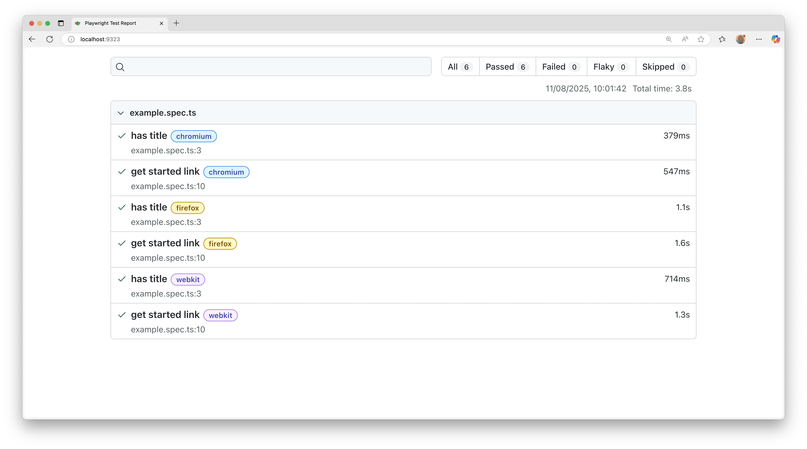
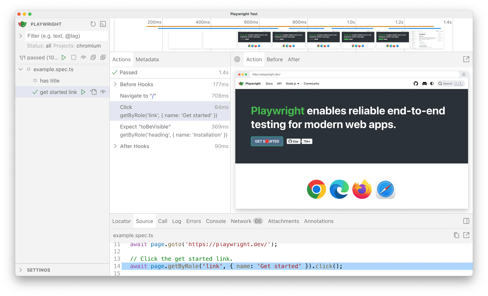

## Introduction

copilotbrowser Test is an end-to-end test framework for modern web apps. It bundles test runner, assertions, isolation, parallelization and rich tooling. copilotbrowser supports Chromium, WebKit and Firefox on Windows, Linux and macOS, locally or in CI, headless or headed, with native mobile emulation for Chrome (Android) and Mobile Safari.

**You will learn**

- [How to install copilotbrowser](/intro.md#installing-copilotbrowser)
- [What's installed](/intro.md#whats-installed)
- [How to run the example test](/intro.md#running-the-example-test)
- [How to open the HTML test report](/intro.md#html-test-reports)

## Installing copilotbrowser

Get started by installing copilotbrowser using one of the following methods.

### Using npm, yarn or pnpm

The command below either initializes a new project or adds copilotbrowser to an existing one.

```bash
npm init copilotbrowser@latest
```

```bash
yarn create copilotbrowser
```

```bash
pnpm create copilotbrowser
```

When prompted, choose / confirm:
- TypeScript or JavaScript (default: TypeScript)
- Tests folder name (default: `tests`, or `e2e` if `tests` already exists)
- Add a GitHub Actions workflow (recommended for CI)
- Install copilotbrowser browsers (default: yes)

You can re-run the command later; it does not overwrite existing tests.

### Using the VS Code Extension

You can also create and run tests with the [VS Code Extension](./getting-started-vscode.md).

## What's Installed

copilotbrowser downloads required browser binaries and creates the scaffold below.

```bash
copilotbrowser.config.ts         # Test configuration
package.json
package-lock.json            # Or yarn.lock / pnpm-lock.yaml
tests/
  example.spec.ts            # Minimal example test
```

The [copilotbrowser.config](./test-configuration.md) centralizes configuration: target browsers, timeouts, retries, projects, reporters and more. In existing projects dependencies are added to your current `package.json`.

`tests/` contains a minimal starter test.

## Running the Example Test

By default tests run headless in parallel across Chromium, Firefox and WebKit (configurable in [copilotbrowser.config](./test-configuration.md)). Output and aggregated results display in the terminal.

```bash
npx copilotbrowser test
```

```bash
yarn copilotbrowser test
```

```bash
pnpm exec copilotbrowser test
```


Tips:
- See the browser window: add `--headed`.
- Run a single project/browser: `--project=chromium`.
- Run one file: `npx copilotbrowser test tests/example.spec.ts`.
- Open testing UI: `--ui`.

See [Running Tests](./running-tests.md) for details on filtering, headed mode, sharding and retries.

## HTML Test Reports

After a test run, the [HTML Reporter](./test-reporters.md#html-reporter) provides a dashboard filterable by the browser, passed, failed, skipped, flaky and more. Click a test to inspect errors, attachments and steps. It auto-opens only when failures occur; open manually with the command below.

```bash
npx copilotbrowser show-report
```

```bash
yarn copilotbrowser show-report
```

```bash
pnpm exec copilotbrowser show-report
```



## Running the Example Test in UI Mode

Run tests with [UI Mode](./test-ui-mode.md) for watch mode, live step view, time travel debugging and more.

```bash
npx copilotbrowser test --ui
```

```bash
yarn copilotbrowser test --ui
```

```bash
pnpm exec copilotbrowser test --ui
```



See the [detailed guide on UI Mode](./test-ui-mode.md) for watch filters, step details and trace integration.

## Updating copilotbrowser

Update copilotbrowser and download new browser binaries and their dependencies:

```bash
npm install -D @copilotbrowser/test@latest
npx copilotbrowser install --with-deps
```

```bash
yarn add --dev @copilotbrowser/test@latest
yarn copilotbrowser install --with-deps
```

```bash
pnpm install --save-dev @copilotbrowser/test@latest
pnpm exec copilotbrowser install --with-deps
```

Check your installed version:

```bash
npx copilotbrowser --version
```

```bash
yarn copilotbrowser --version
```

## MCP Server — AI Agent Browser Control

copilotbrowser ships a built-in **MCP server** that exposes browser automation as tools for GitHub Copilot, Claude, and any other MCP-compatible AI agent.

### Quick setup

Add the following to your `.mcp.json` (create at your project or home root):

```json
{
  "mcpServers": {
    "copilotbrowser": {
      "command": "npx",
      "args": ["copilotbrowser", "run-mcp-server", "--browser", "msedge"]
    }
  }
}
```

Supported `--browser` values: `msedge`, `chromium`, `firefox`, `webkit`.

### What the MCP server provides

Once connected, your AI agent gains browser tools such as `browser_navigate`, `browser_click`, `browser_fill`, `browser_snapshot`, `browser_screenshot`, and `browser_run_code`. The agent can autonomously navigate sites, fill forms, extract data, and take screenshots without any additional configuration.

### "Follow me" mode

You can also teach the agent by performing steps manually while copilotbrowser records them. The agent learns your navigation pattern and can replay or adapt the same steps autonomously — useful for multi-step workflows, authentication flows, and UI testing.

### Local build setup (from source)

If you are working from a source checkout, use the compiled CLI directly:

```bash
node packages/copilotbrowser/cli.js run-mcp-server --browser msedge
```

Or run the quick-start onboarding script to build and install everything in one step:

```bash
bash install.sh
```

```bash
pnpm exec copilotbrowser --version
```

## System requirements

- Node.js: latest 20.x, 22.x or 24.x.
- Windows 11+, Windows Server 2019+ or Windows Subsystem for Linux (WSL).
- macOS 14 (Ventura) or later.
- Debian 12 / 13, Ubuntu 22.04 / 24.04 (x86-64 or arm64).

## What's next

- [Write tests using web-first assertions, fixtures and locators](./writing-tests.md)
- [Run single or multiple tests; headed mode](./running-tests.md)
- [Generate tests with Codegen](./codegen-intro.md)
- [View a trace of your tests](./trace-viewer-intro.md)
